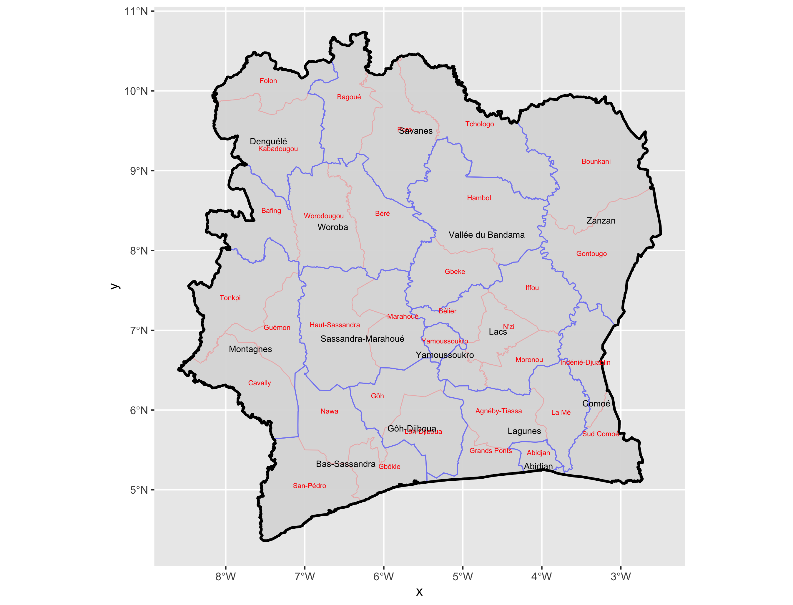
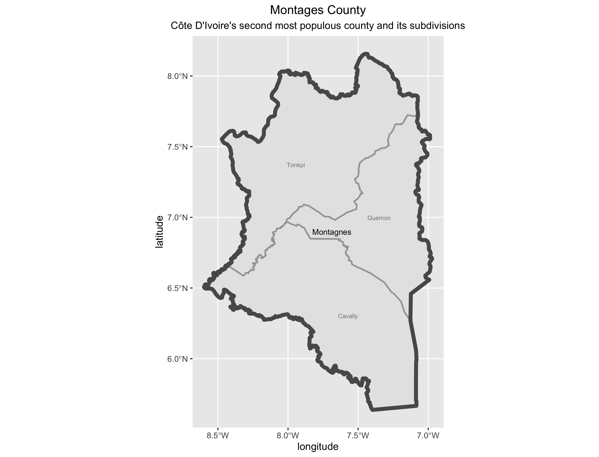
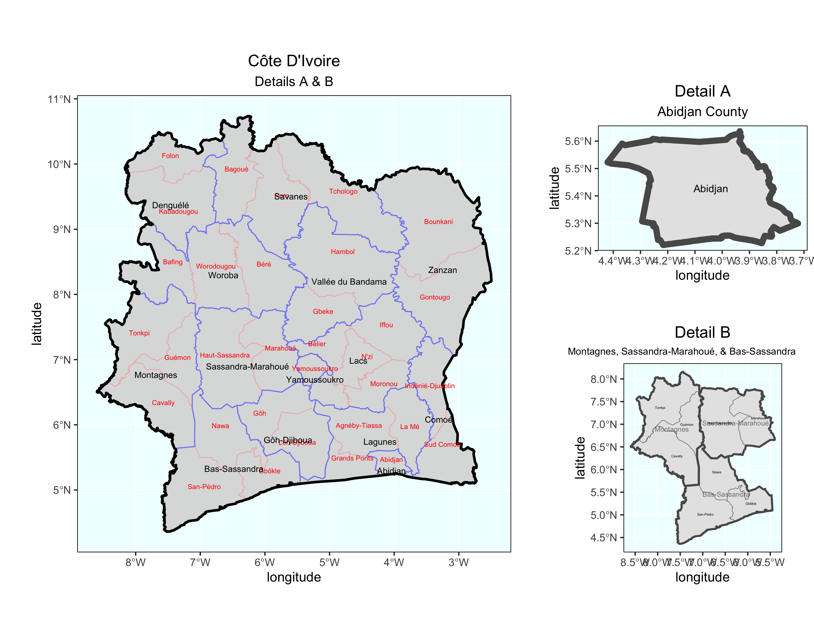
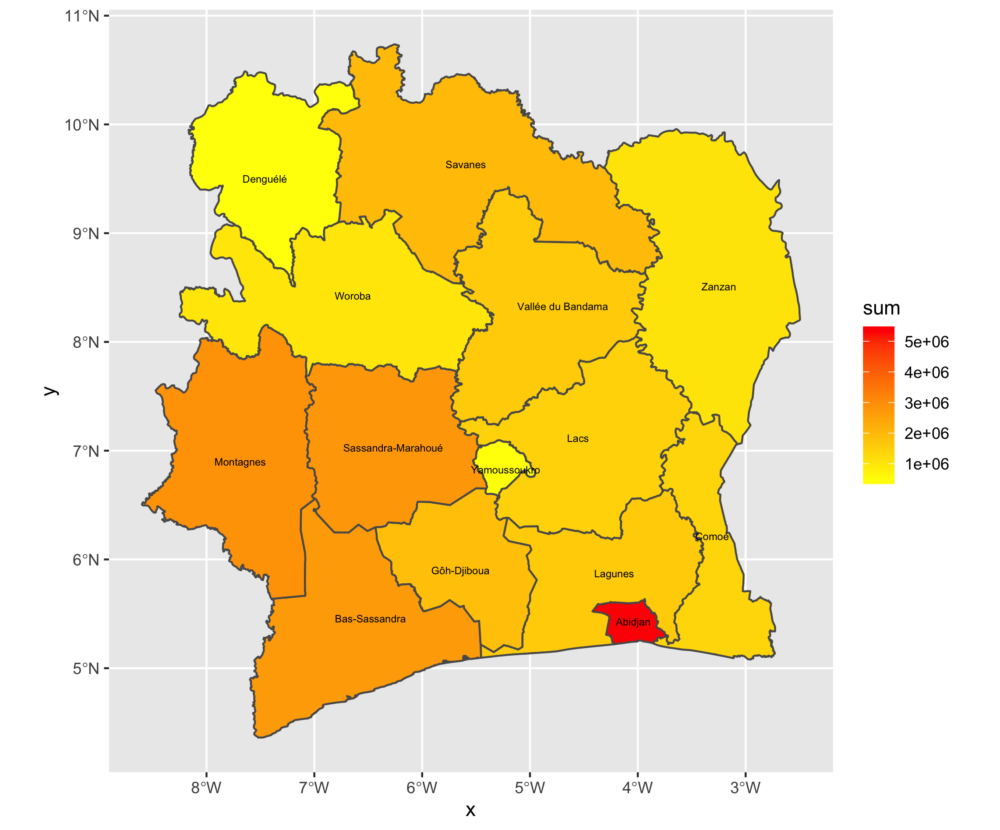
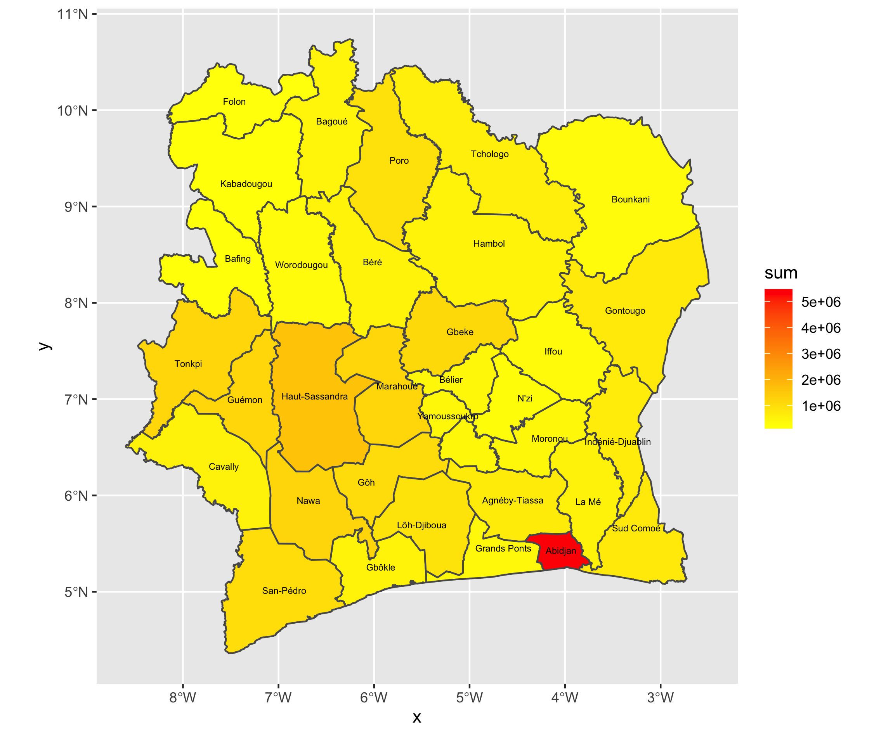
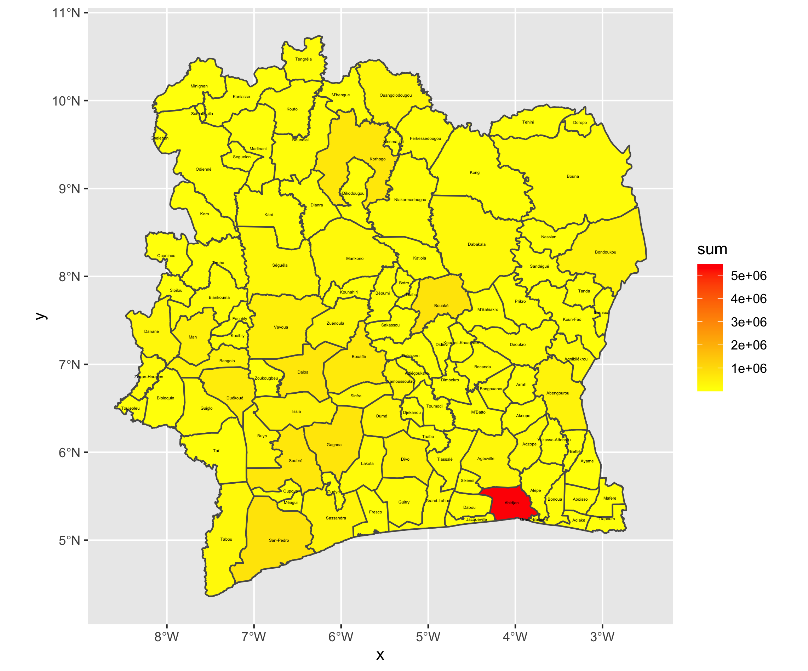
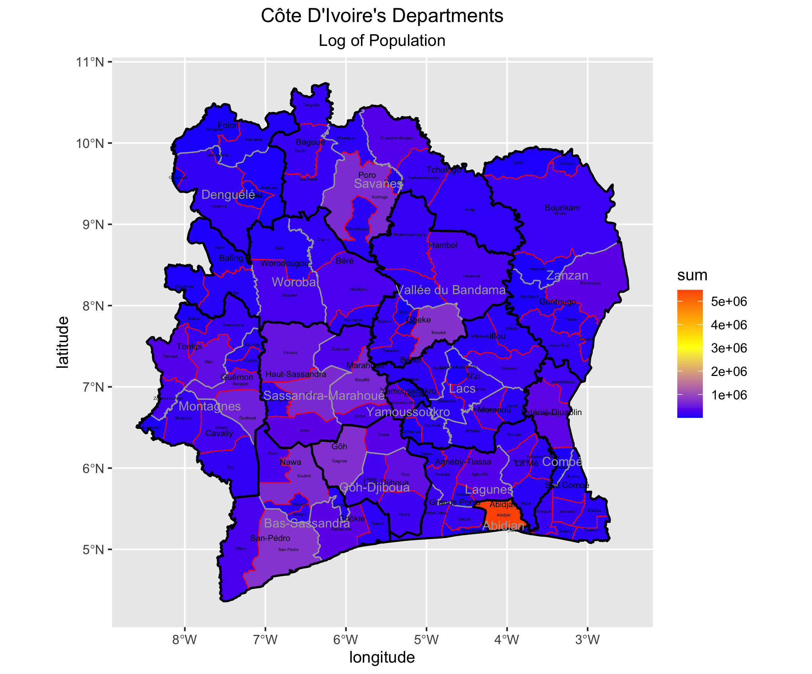

# Spatial Population Description

The country that I chose to model was Côte D'Ivoire.

This is the image of the entire country:

One challenge that I had with this image and the other images 
was figuring out how to move the text so that the names of the 
counties and districts won't overlap. I tried my best 
to prevent overlap, but ask you can see in the image, 
it isn't 100%. 

I chose to model the second most populous county in the Ivory
Coast, because the most populous county did not have any
districts. 

But in the final image, I chose to include the most populous
county, Abidjan, as one of the smaller plots. I also included
the group of Montagnes, Sassandra-Marahoué, and Bas-Sassandra 
counties. The overlap issue was also present in this plot. 

Below are the three images that I created to show Spatial 
Population Distribution on three levels - Districts, Regions,
and Departments. One challenge I had with creating these
images was extracting the population data from the shp file.
Once I got that, though, it was smooth sailing from there!

### Districts 

### Regions

### Departments

If you look at these images, you can see that the district
Abidjan is actually a district, region, and department. I
believe that if we were somehow able to remove it from 
the dataset, the other areas of Côte D'Ivoire would have
more variation. Especially the Departments map, there is hardly
any variation in the other areas. 

Next, I made the graph for the population of the districts,
regions, and departments - all in one graph:

Again, you can see that the district Abidjan is really
populous, and is thus making the scale skewed. However,
the other departments may not be as populous, which is also
causing most of the departments to appear blue.